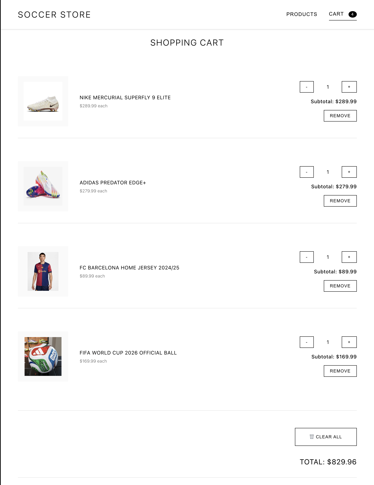
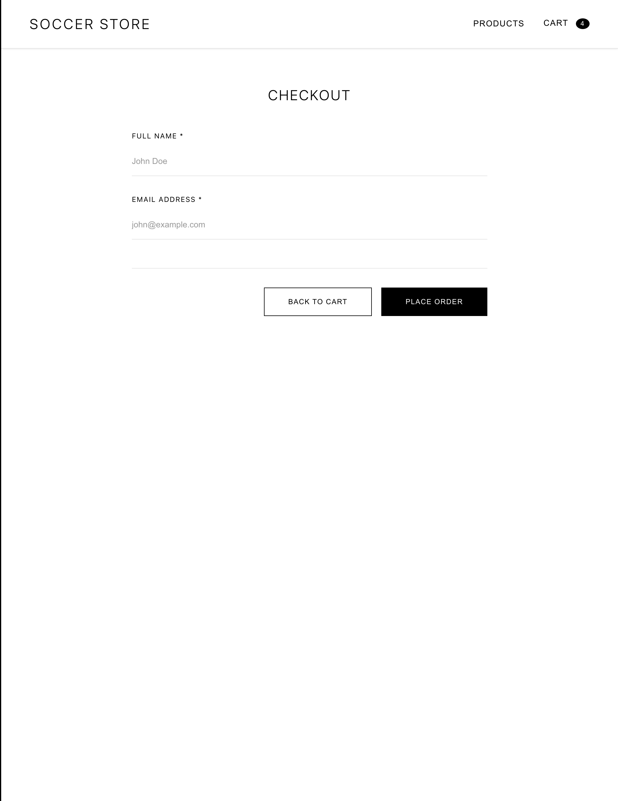
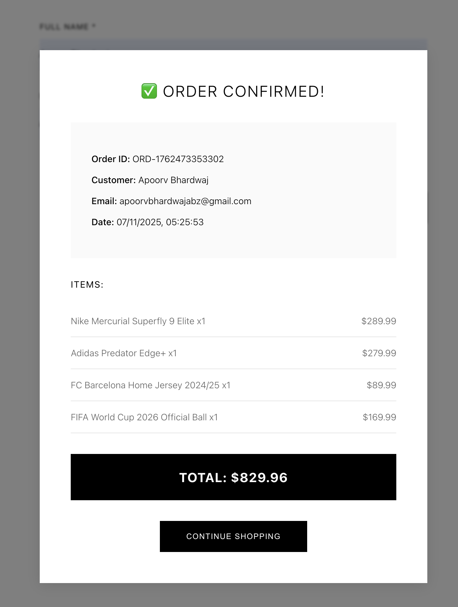

# Vibe Commerce - Full Stack Shopping Cart

A complete e-commerce shopping cart application built with React, Node.js, Express, and SQLite.

## 🎥 Demo Video
https://youtu.be/WEfLzP6teJs

## project link
https://soccer-store-gold.vercel.app

## 📸 Screenshots

### Products Page


### Shopping Cart


### Checkout


### Order Receipt


## 🚀 Features

- ✅ Browse 10 mock products with images and descriptions
- ✅ Add products to cart with quantity management
- ✅ Update and remove cart items
- ✅ Real-time cart total calculation
- ✅ Checkout form with validation
- ✅ Mock order receipt generation
- ✅ Responsive design for mobile and desktop
- ✅ SQLite database for data persistence
- ✅ REST API backend with Express
- ✅ Error handling and loading states

## 🛠️ Tech Stack

**Frontend:**
- React 18
- Axios for API calls
- CSS3 with responsive design

**Backend:**
- Node.js
- Express.js
- SQLite3 database
- CORS enabled

## 📦 Installation & Setup

### Prerequisites
- Node.js (v14 or higher)
- npm or yarn

### Backend Setup

1. Navigate to backend folder:
```bash
cd backend
```

2. Install dependencies:
```bash
npm install
```

3. Start the backend server:
```bash
node server.js
```

Server runs on `http://localhost:5000`

### Frontend Setup

1. Open a new terminal and navigate to frontend folder:
```bash
cd frontend
```

2. Install dependencies:
```bash
npm install
```

3. Start the React app:
```bash
npm start
```

App opens automatically at `http://localhost:3000`

## 🗂️ Project Structure

```
vibe-commerce/
├── backend/
│   ├── routes/
│   │   ├── products.js      # Products API endpoints
│   │   ├── cart.js          # Cart management endpoints
│   │   └── checkout.js      # Checkout processing
│   ├── database.js          # SQLite database setup
│   ├── server.js            # Express server
│   ├── commerce.db          # SQLite database (auto-generated)
│   └── package.json
├── frontend/
│   ├── src/
│   │   ├── components/
│   │   │   ├── Products.js  # Products grid component
│   │   │   ├── Cart.js      # Shopping cart component
│   │   │   └── Checkout.js  # Checkout form component
│   │   ├── App.js           # Main app component
│   │   ├── App.css          # Styling
│   │   └── index.js
│   └── package.json
└── README.md
```

## 🔌 API Endpoints

### Products
- `GET /api/products` - Get all products
- `GET /api/products/:id` - Get single product

### Cart
- `GET /api/cart` - Get cart items with total
- `POST /api/cart` - Add item to cart
  - Body: `{ productId: number, quantity: number }`
- `PUT /api/cart/:id` - Update cart item quantity
  - Body: `{ quantity: number }`
- `DELETE /api/cart/:id` - Remove item from cart

### Checkout
- `POST /api/checkout` - Process checkout and generate receipt
  - Body: `{ name: string, email: string }`

## 💡 How It Works

1. **Products**: App loads 10 mock products from SQLite database on startup
2. **Add to Cart**: Click "Add to Cart" to add items (quantities combine if item exists)
3. **Cart Management**: View cart, update quantities with +/- buttons, or remove items
4. **Checkout**: Fill in name and email, submit to generate mock order receipt
5. **Receipt**: Modal displays order confirmation with order ID, items, and total
6. **Database**: All data persists in SQLite (`commerce.db`)

## 🎨 Design Features

- Modern gradient header
- Card-based product grid
- Smooth hover animations
- Responsive layout (mobile-friendly)
- Loading states and error handling
- Success feedback on actions
- Modal overlay for receipts

## 🧪 Testing Instructions

1. Start both backend and frontend servers
2. Add products to cart from Products page
3. Navigate to Cart using header button
4. Modify quantities or remove items
5. Click "Proceed to Checkout"
6. Fill in checkout form and submit
7. Verify receipt modal appears with correct details
8. Refresh page to confirm data persistence

## 🔄 Future Enhancements

- User authentication
- Real payment integration
- Product search and filters
- Order history
- Admin panel for product management
- Multiple user carts

## 👨‍💻 Developer

Created as part of Vibe Commerce internship screening assignment.

## 📝 License

This project is for evaluation purposes only.